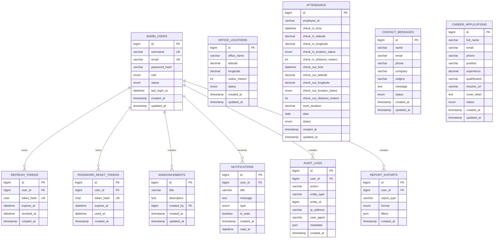

# HYA Tech SQL Database Schema

Production database name: `hyatech_db`

Canonical SQL script:

```text
server/database/schema.sql
```

## Entity Diagram



## Production Notes

- All primary data tables use InnoDB, `utf8mb4`, primary keys, indexed timestamps, and status indexes.
- Passwords are stored only as bcrypt hashes.
- Refresh and password reset tokens are stored as SHA-256 hashes, never in plaintext.
- Contact and career tables include full-text indexes for scalable admin search.
- Foreign keys use restrictive or cascading deletes depending on data ownership.
